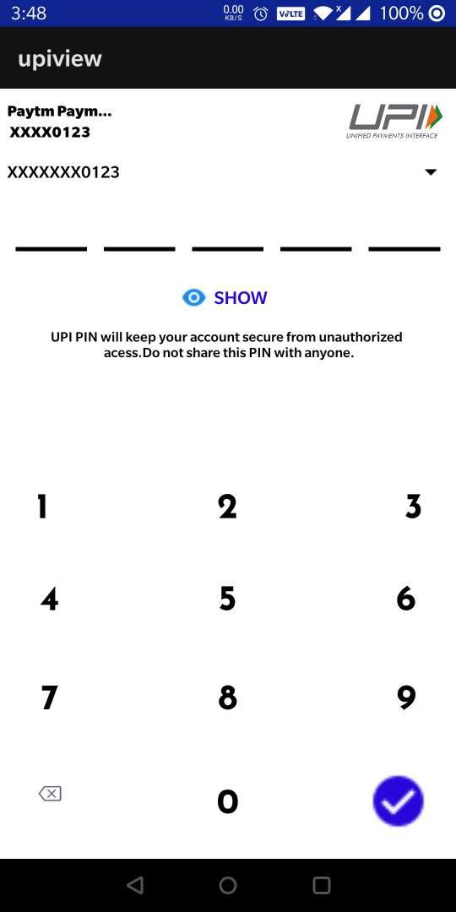

# BharatUPI_View

## Cheer For India ! 

**A Custom View UPI Pin View Library Made in Java &amp; Kotlin with UPI Keyboard Functionality as well.**
#### This Libary is under constant Updates. Thanks to @Shefali Ma'am and @Bhupendera Sir for the Constant.

### Release Notes
- **1.0** Intial Release of the Custom View (Disabled the UPI Custom Keyboard for now) 

- This Library can be used in payment related applications.
- Feel Free to contribute to this project if you like.

**Screenshots of the Libary**

<table>
  <tr>
    <td>Ui Preview</td>
     <td></td>
   </tr>
  <tr>
    <td></td>
  </tr>
 </table>

------------

## Installation

##### Add  The jitpack repository inside the settings.fradle file of your project.

    dependencyResolutionManagement {
                repositoriesMode.set(RepositoriesMode.FAIL_ON_PROJECT_REPOS)
                repositories {
                    google()
                    mavenCentral()
                    jcenter() // Warning: this repository is going to shut down soon
                    maven { url "https://jitpack.io" }
                }
    }

------------

#####  Add the dependency inside the android project

Uploading to JitPack.io soon.

------------

